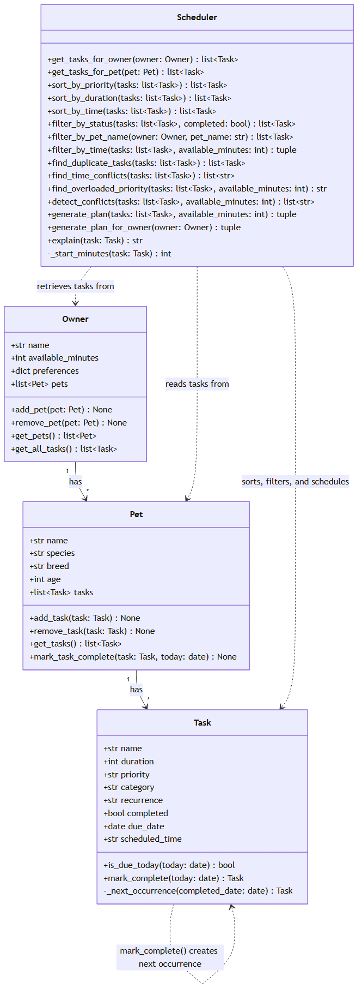

# PawPal+ (Module 2 Project)

You are building **PawPal+**, a Streamlit app that helps a pet owner plan care tasks for their pet.

## Scenario

A busy pet owner needs help staying consistent with pet care. They want an assistant that can:

- Track pet care tasks (walks, feeding, meds, enrichment, grooming, etc.)
- Consider constraints (time available, priority, owner preferences)
- Produce a daily plan and explain why it chose that plan

Your job is to design the system first (UML), then implement the logic in Python, then connect it to the Streamlit UI.

## What you will build

Your final app should:

- Let a user enter basic owner + pet info
- Let a user add/edit tasks (duration + priority at minimum)
- Generate a daily schedule/plan based on constraints and priorities
- Display the plan clearly (and ideally explain the reasoning)
- Include tests for the most important scheduling behaviors

## Getting started

### Setup

```bash
python -m venv .venv
source .venv/bin/activate  # Windows: .venv\Scripts\activate
pip install -r requirements.txt
```

### Suggested workflow

1. Read the scenario carefully and identify requirements and edge cases.
2. Draft a UML diagram (classes, attributes, methods, relationships).
3. Convert UML into Python class stubs (no logic yet).
4. Implement scheduling logic in small increments.
5. Add tests to verify key behaviors.
6. Connect your logic to the Streamlit UI in `app.py`.
7. Refine UML so it matches what you actually built.

## 🖥️ Sample Output

Output from running `python main.py`:

```
Today's Schedule for Jordan (60 minutes available)
==================================================
- Vet checkup           15 min  [high priority]  (health)
    -> Vet checkup (high priority, 15 min) scheduled for health.
- Morning walk          30 min  [high priority]  (walk)
    -> Morning walk (high priority, 30 min) scheduled for walk.
- Litter box cleaning   15 min  [medium priority]  (grooming)
    -> Litter box cleaning (medium priority, 15 min) scheduled for grooming.
--------------------------------------------------
Total scheduled time: 60 / 60 minutes

Skipped (ran out of time):
- Evening walk (20 min, medium priority)
- Playtime (20 min, low priority)

Conflicts:
- Time conflict: 'Playtime' (09:00, 20 min) overlaps with 'Vet checkup' (09:15, 15 min)

==================================================
Sorted by time of day:
- 07:30  Morning walk (30 min)
- 08:00  Feeding (10 min)
- 08:00  Feeding (10 min)
- 09:00  Playtime (20 min)
- 09:15  Vet checkup (15 min)
- 12:00  Litter box cleaning (15 min)
- 18:00  Evening walk (20 min)

Incomplete tasks (filter_by_status):
- Evening walk
- Morning walk
- Vet checkup
- Feeding
- Litter box cleaning
- Playtime

Biscuit's tasks (filter_by_pet_name):
- Evening walk
- Feeding
- Morning walk
- Vet checkup
- Feeding

All of Biscuit's Feeding occurrences (completing spawns the next one):
- completed=True, due_date=2026-07-12
- completed=False, due_date=2026-07-13
```

## 🧪 Testing PawPal+

```bash
# Run the full test suite:
pytest

# Run with coverage:
pytest --cov
```

# Command to run tests:
python -m pytest

# Description of what the tests cover:

My tests check that the app behaves correctly in 10 different situations:

1. Marking a task done actually flips its status
2. Adding a task to a pet actually shows up in that pet's list
3. The schedule picks the most important tasks first and stops once the day's time runs out
4. A pet with no tasks doesn't break anything — it just returns an empty plan
5. A day with zero free minutes correctly skips everything instead of crashing
6. Finishing a daily task automatically lines up tomorrow's version of that same task
7. Finishing a one-time task (like a vet visit) does not keep coming back
8. A task due exactly today is correctly treated as "due," not accidentally skipped
9. Tasks scheduled at different times come back sorted in the right order, earliest first
10. Two tasks accidentally scheduled for the same time get flagged with a warning

Together, these 10 tests confirm the app handles both the everyday cases (adding tasks, building a normal schedule) and the tricky edge cases (empty pets, no time left, exact-time conflicts) without breaking or giving a misleading plan.

```
#Paste your pytest output here:

============================= test session starts =============================
collected 10 items

tests/test_pawpal.py::test_mark_complete_changes_status PASSED           [ 10%]
tests/test_pawpal.py::test_add_task_increases_pet_task_count PASSED      [ 20%]
tests/test_pawpal.py::test_generate_plan_prioritizes_and_fits_available_time PASSED [ 30%]
tests/test_pawpal.py::test_generate_plan_with_no_tasks_returns_empty_plan PASSED [ 40%]
tests/test_pawpal.py::test_filter_by_time_skips_everything_when_no_minutes_available PASSED [ 50%]
tests/test_pawpal.py::test_mark_task_complete_schedules_next_occurrence_one_day_later PASSED [ 60%]
tests/test_pawpal.py::test_mark_task_complete_does_not_recur_for_one_time_tasks PASSED [ 70%]
tests/test_pawpal.py::test_is_due_today_is_true_when_due_date_is_exactly_today PASSED [ 80%]
tests/test_pawpal.py::test_sort_by_time_returns_tasks_in_chronological_order PASSED [ 90%]
tests/test_pawpal.py::test_find_time_conflicts_detects_tasks_at_the_exact_same_start_time PASSED [100%]

============================= 10 passed in 0.05s ==============================
```

## 🗺️ System Architecture (UML)

The diagram below ([diagrams/uml_final.mmd](diagrams/uml_final.mmd)) reflects the final code in `pawpal_system.py`, including the methods and relationships added while building out sorting, filtering, recurrence, and conflict detection.



## 📐 Smarter Scheduling

> Fill in once you've implemented scheduling logic.

| Feature | Method(s) | Notes |
|---------|-----------|-------|
| Task sorting | | e.g., by priority, duration |
| Filtering | | e.g., skip tasks if time runs out |
| Conflict handling | | e.g., overlapping time slots |
| Recurring tasks | | e.g., daily vs. weekly |

## 📸 Demo Walkthrough

Describe app in numbered steps so a reader can follow along without watching a video

1. Open the app and type in your name and how many minutes you have today for pet care.
2. Add a pet by typing its name and picking its species.
3. Pick that pet from the list and add a task for it (like "Morning walk"), along with how long it takes and how important it is.
4. Repeat step 3 for as many tasks and pets as you'd like.
5. Click "Generate schedule" to see today's plan, built from your most important and best-fitting tasks.
6. If something doesn't fit or two tasks are scheduled at the same time, the app warns you instead of just leaving it out silently.

**Screenshot or video** *(optional)*: <!-- Insert a screenshot or link to a demo video here -->

### Main UI Features, Example Workflow, Key Scheduler behaviors shown, sample CLI output from running main.py:

The app lets you set up an owner and how much time they have today, add one or more pets, and give each pet a list of tasks (with a duration, a priority, an optional time of day, and how often it repeats). From there you can sort or filter the task list, mark a task done, and generate today's schedule.

**Example workflow:** add a pet named "Mochi" → add a task "Morning walk" for Mochi (20 min, high priority, repeats daily) → click "Generate schedule" → see today's plan, in priority order, along with any warnings if something doesn't fit or two tasks collide.

Along the way, you can see the Scheduler's behaviors directly: tasks get **sorted** by priority, duration, or time of day; you can **filter** the list down to just one pet or just unfinished tasks; **conflicts** (duplicates, overlapping times, or too much high-priority work for the day) show up as warnings instead of silently breaking the plan; and marking a repeating task done automatically lines up its next occurrence.

Here's the same behaviors, shown from the command line (`python main.py`):

```
Today's Schedule for Jordan (60 minutes available)
==================================================
- Vet checkup           15 min  [high priority]  (health)
    -> Vet checkup (high priority, 15 min) scheduled for health.
- Morning walk          30 min  [high priority]  (walk)
    -> Morning walk (high priority, 30 min) scheduled for walk.
- Litter box cleaning   15 min  [medium priority]  (grooming)
    -> Litter box cleaning (medium priority, 15 min) scheduled for grooming.
--------------------------------------------------
Total scheduled time: 60 / 60 minutes

Skipped (ran out of time):
- Evening walk (20 min, medium priority)
- Playtime (20 min, low priority)

Conflicts:
- Time conflict: 'Playtime' (09:00, 20 min) overlaps with 'Vet checkup' (09:15, 15 min)

==================================================
Sorted by time of day:
- 07:30  Morning walk (30 min)
- 08:00  Feeding (10 min)
- 08:00  Feeding (10 min)
- 09:00  Playtime (20 min)
- 09:15  Vet checkup (15 min)
- 12:00  Litter box cleaning (15 min)
- 18:00  Evening walk (20 min)

Incomplete tasks (filter_by_status):
- Evening walk
- Morning walk
- Vet checkup
- Feeding
- Litter box cleaning
- Playtime

Biscuit's tasks (filter_by_pet_name):
- Evening walk
- Feeding
- Morning walk
- Vet checkup
- Feeding

All of Biscuit's Feeding occurrences (completing spawns the next one):
- completed=True, due_date=2026-07-12
- completed=False, due_date=2026-07-13
```

## Smarter Scheduling:

Document each feature implemented and name the method it implements:

- **Sorting behavior** (`Scheduler.sort_by_priority()`, `Scheduler.sort_by_duration()`, `Scheduler.sort_by_time()`) — puts the most important tasks first, and among equally important tasks, puts the quicker ones first so more tasks fit in the day. You can also sort by how long a task takes or by what time of day it happens.

- **Filtering behavior** (`Scheduler.filter_by_status()`, `Scheduler.filter_by_pet_name()`, `Scheduler.get_tasks_for_owner()`, `Scheduler.get_tasks_for_pet()`) — lets you view just one pet's tasks, just finished or unfinished tasks, or only the tasks that actually need doing today.

- **Conflict detection logic** (`Scheduler.detect_conflicts()`) — warns you if the same task got added twice by accident, if two tasks are scheduled for the same time, or if you have more "must-do" tasks than you have time for today.

- **Recurring task logic** (`Task.mark_complete()` and `Pet.mark_task_complete()`) — when you finish a daily or weekly task, the app automatically lines up the next one for tomorrow (or next week) so you don't have to re-add it yourself.
